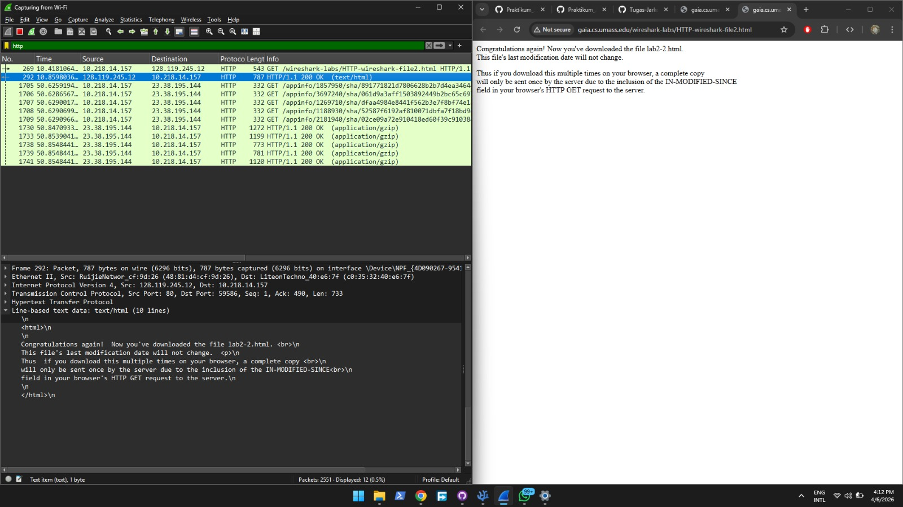
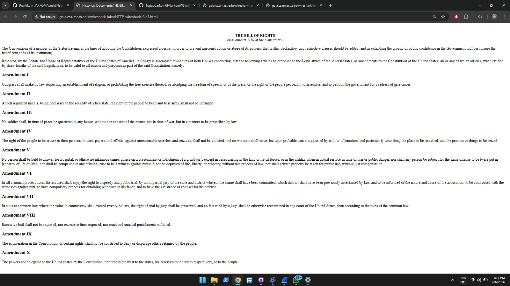
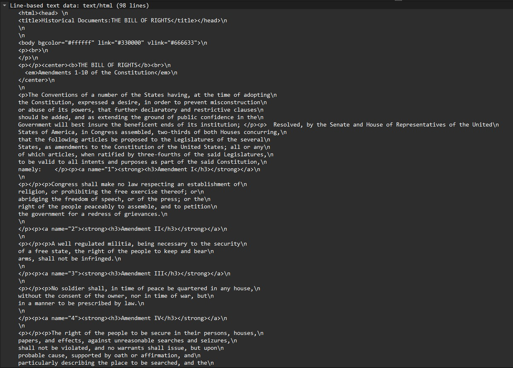
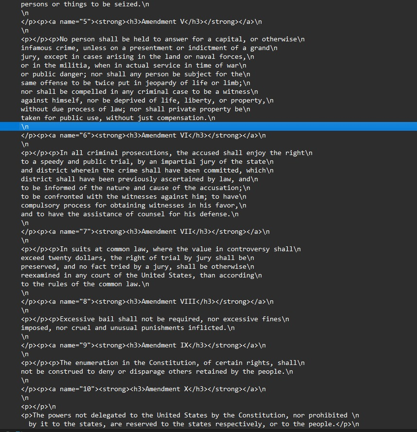
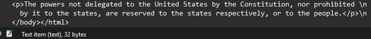

##
Nama       : Dyandra Alifyan Nugroho  
NIM        : 103072400161  
Kelas      : IF-04-05  
Mata Kuliah: Jaringan Komputer  
---
## 
Tujuan Praktikum 
1. Mahasiswa dapat menginvestigasi cara kerja protokol HTTP menggunakan Wireshark. 
---

1. Get response / http
    Buka wireshark dan pilih wifi

2. Buka browser (terserah) copy dan masuk ke link berikut, http://gaia.cs.umass.edu/wireshark-labs/HTTP-wireshark-file1.html, Buka wireshark kembali dan ketik http pada filter pencarian, maka akan muncul 2 paket HTTP utama(GET dan response).

3. Perhatikan baris length info berteks 200 ok (text/html), lalu dapat dilihat hypertext dan Line-based text data.

### HTTP Conditional GET
5. Buka kembali browser dan masuk ke link berikut, http://gaia.cs.umass.edu/wireshark-labs/HTTP-wireshark-file2.html. Buka kembali wireshark dan ketik http pada pencarian. Perhatikan baris length info 200 ok (text/html)

### Retrieving Long Documents
6. Kembali ke browser dan buka link berikut, http://gaia.cs.umass.edu/wireshark-labs/HTTP-wireshark-file3.html.

7. Buka kembali wireshark dan ketik http pada pencarian. Perhatikan baris length info 200 ok (text/html),
   lalu lihat hypertext dan Line-based text datanya.

