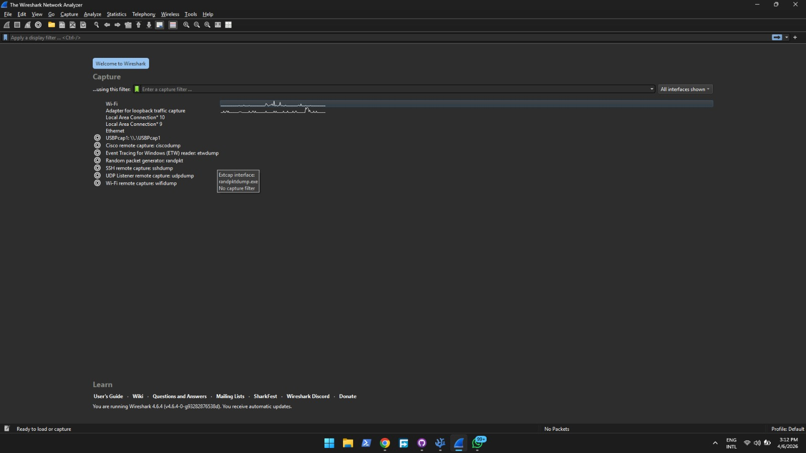
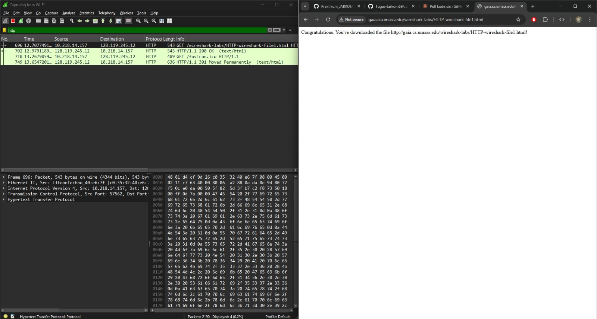
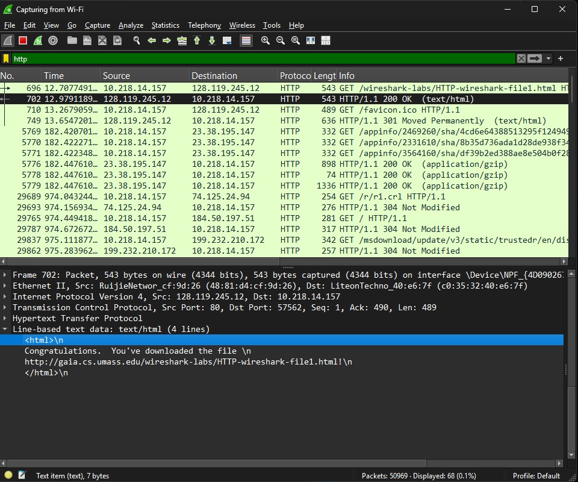
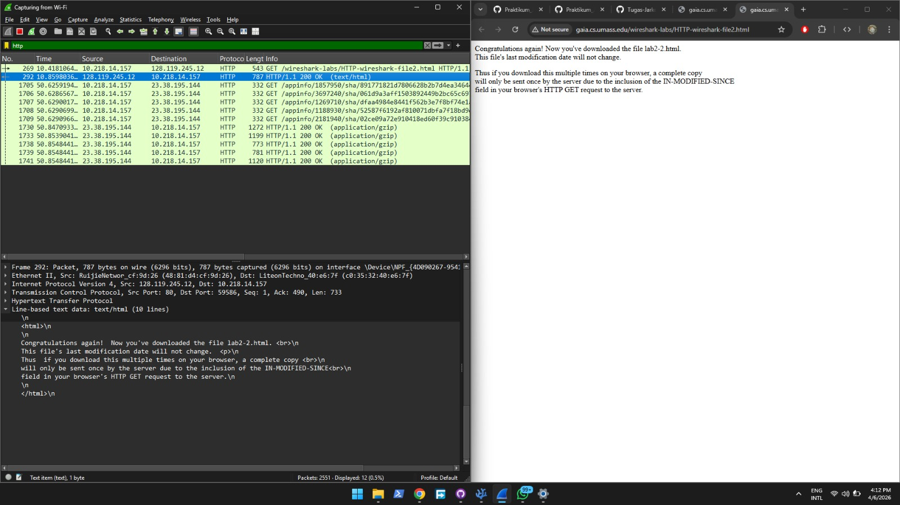
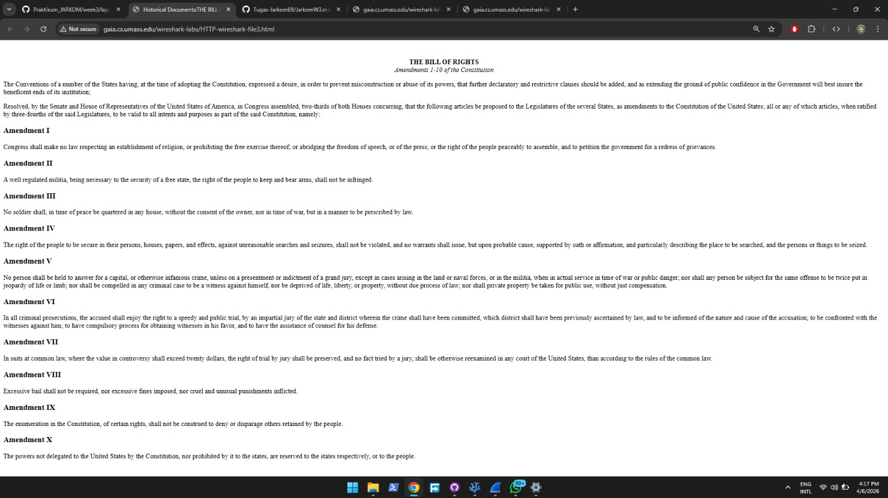
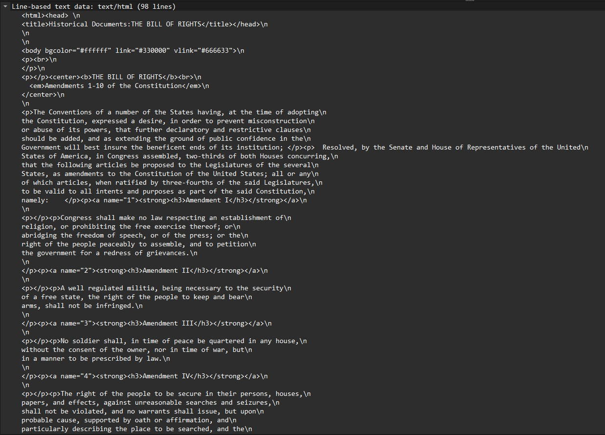
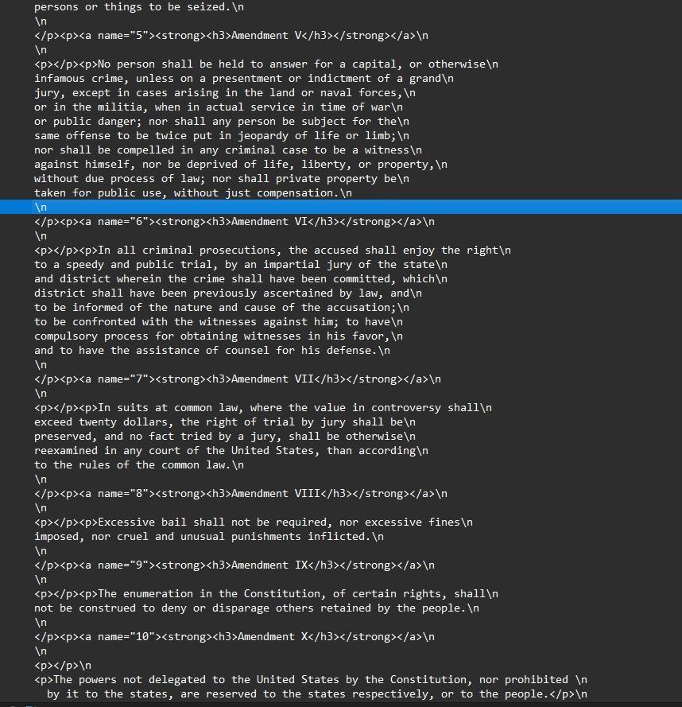
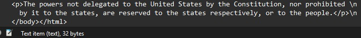

# Laporan Praktikum HTTP

**Nama:** Dyandra Alifyan Nugroho  
**NIM:** 103072400161  
**Kelas:** IF-04-05  
**Mata Kuliah:** Jaringan Komputer

---

## Tujuan Praktikum
1. Mahasiswa dapat menginvestigasi cara kerja protokol HTTP menggunakan Wireshark.

---

### Get Response / HTTP

Langkah-langkah mengamati HTTP GET dan response menggunakan Wireshark:

1. Buka Wireshark dan pilih antarmuka jaringan WiFi yang aktif.

2. Buka browser (bebas), lalu kunjungi URL berikut:  
   `http://gaia.cs.umass.edu/wireshark-labs/HTTP-wireshark-file1.html`  
   Buka kembali Wireshark dan ketik `http` pada kolom filter pencarian. Akan muncul 2 paket HTTP utama, yaitu GET (permintaan) dan 200 OK (balasan).

3. Perhatikan baris yang menampilkan informasi `200 OK (text/html)`. Klik baris tersebut dan amati detail Hypertext Transfer Protocol serta Line-based text data pada panel bawah.

---

### HTTP Conditional GET

HTTP Conditional GET digunakan untuk memeriksa apakah dokumen telah dimodifikasi sejak permintaan sebelumnya, sehingga server dapat merespons dengan `304 Not Modified` tanpa mengirim ulang isi dokumen.

4. Kembali ke browser dan kunjungi URL berikut:  
   `http://gaia.cs.umass.edu/wireshark-labs/HTTP-wireshark-file2.html`  
   Buka kembali Wireshark dan ketik `http` pada kolom filter. Perhatikan baris yang menampilkan `200 OK (text/html)`. Pada percobaan kedua (akses ulang), perhatikan apakah muncul header `If-Modified-Since` pada pesan GET dan apakah server memberikan respons `304 Not Modified`.

---

### Retrieving Long Documents

Bagian ini mengamati bagaimana browser mengambil dokumen panjang, di mana server perlu membagi respons HTTP ke dalam beberapa segmen TCP.

5. Kembali ke browser dan buka URL berikut:  
   `http://gaia.cs.umass.edu/wireshark-labs/HTTP-wireshark-file3.html`

6. Buka kembali Wireshark dan ketik `http` pada kolom filter. Perhatikan baris yang menampilkan `200 OK (text/html)`, kemudian amati Hypertext Transfer Protocol dan Line-based text data. Karena dokumen berukuran besar, respons dibawa dalam beberapa segmen TCP (`TCP segment of a reassembled PDU`).

---

Berdasarkan praktikum yang telah dilakukan, dapat disimpulkan bahwa protokol HTTP berjalan di atas protokol TCP dan bekerja dengan mekanisme request-response. Browser mengirimkan pesan HTTP GET kepada server, dan server merespons dengan status 200 OK beserta isi dokumen yang diminta.

Melalui fitur HTTP Conditional GET, browser memanfaatkan header `If-Modified-Since` untuk mengecek apakah dokumen sudah diperbarui. Apabila dokumen belum berubah, server cukup membalas dengan `304 Not Modified` tanpa mengirimkan ulang isi dokumen, sehingga menghemat bandwidth.

Untuk dokumen berukuran besar, respons HTTP dipecah menjadi beberapa segmen TCP yang kemudian disusun kembali oleh browser. Wireshark memungkinkan kita mengamati seluruh proses ini secara rinci, mulai dari TCP handshake hingga pengiriman dan penerimaan data HTTP.
